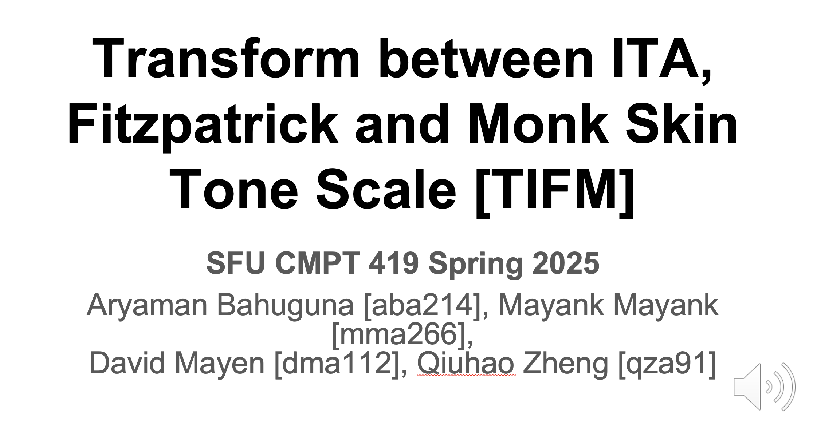

[]()

# Transform between ITA, Fitzpatrick and Monk Skin Tone Scale [TIFM]
This project attempts to provides code to convert between three major skin color models: Individual Typology Angle (ITA), Fitzpatrick, and the Monk Skin Tone Scale. By enabling interoperability between these representations, there is a potential to support research in dermatology, computer vision, and fairness in AI.

---
<!-- table of contents-->
## 📚 Table of Contents
- [💡 Motivation](#-motivation)
- [🔗 Important Links](#-important-links)
- [📽️ Demo Video](#-demo)
- [📁 Directory Structure](#-directory-structure)
- [🔄 Reproducing Our Results](#-reproducing-our-results)
- [⚙️ Running the Skin-Tone-App](#-running-the-skin-tone-app)
- [📊 Outputs Brief Summary](#-outputs-brief-summary)
- [🚀 Future Enhancements](#-future-enhancements)
- [✅ Status: Complete](#-status-complete)
- [📕 Cite](#-cite)
- [🔗 Important References](#-references)

## 💡 Motivation
some motivational text here

## 🔗 Important Links

| [Timesheet](https://1sfu-my.sharepoint.com/:x:/g/personal/hamarneh_sfu_ca/EVzrKxoqTBhBsnZ7Bn1OLCUBmp6XPn5tKw3TadBanr7LiQ?e=WcadSt) | [Slack channel](https://cmpt419spring2025.slack.com/archives/C086RGM0DPB) | [Project report](https://www.overleaf.com/3181635329dsvqshmwvmyz#fe2229) | 
|-----------|---------------|-------------------------|


**Datasets Directory**: [📂Google Drive](https://drive.google.com/file/d/1UDtpJlG0P_UmH77h9ikWEtPiBslqMqmi/view?usp=share_link)


## 📽️ Demo Video

[](https://youtu.be/SyvPoIzR_4A)
[](https://youtu.be/SyvPoIzR_4A)


## 📁 Directory Structure
```bash
repository
├── app                          ## source code of the package itself
├── datasets                     ## datasets used in the project
├── code                         ## source code of the package itself
```

## 🔄 Reproducing Our Results
Our analysis includes generating ITA scores, training deep learning models to predict Fitzpatrick scores, and Monk Skin Tone Scale scores for a set of images. The code is organized into different modules for each task.

### Gcloud Setup
Due to the requirement of a GPU for training the models, we used Google Cloud Platform (GCP) to train the models. For a detailed guide on how to set up GCP, please refer to the [GCP setup guide](./guide-running-dl-models/guided-pdf.pdf) created by us especially curated for this project.

### Cloning the Repository
To clone the repository, run the following command:
```bash
git clone git@github.com:sfu-cmpt340/2025_1_project_20.git
cd 2025_1_project_20/
```

**⚠️Caution**: The models will not be included in the repository by default due to being uploaded through Git LFS. Run the following command after cloning the repository to download the models:
```bash
sudo apt-get install git-lfs
git lfs install
git lfs pull
```
**‼️Important**: You will need to download the `datasets` directory from [📂Google Drive](https://drive.google.com/file/d/1UDtpJlG0P_UmH77h9ikWEtPiBslqMqmi/view?usp=share_link) and place it in the root directory of the project before proceeding. It has been omitted from the repository due to its huge size (~12Gigs).

### 1. ITA Score Calculation
The ITA score is calculated using the `ita.py` module. We generate the results on a [📊Kaggle Dataset](https://www.kaggle.com/datasets/usamarana/skin-tone-classification-dataset) of skin tones. The dataset is available in the `datasets` directory (downloadable through google drive link above).

```bash
cd code/ita
python3 ita.py
```
Also see [ita.ipynb](code/ita/ita.ipynb) for detailed iterations of code.

### 2. Fitzpatrick Score Calculation
The Fitzpatrick score is predicted using a deep learning model in `fitzpatrick.py` module. The models are available under `code/fitzpatrick/models` for anyone to use. We trained [Efficient-NetV2](https://huggingface.co/timm/efficientnetv2_rw_m.agc_in1k) on the [fitzpatrick17k](https://github.com/mattgroh/fitzpatrick17k) dataset (also,available in the `datasets` directory downloadable through google drive link above).
```bash
cd code/fitzpatrick/
python3 f-pre-process-data.py # pre-process data
python3 fitzpatrick-efficientV2.py # to train model
python3 fitzpatrick.py # predict on a sample image
```

Since converting a categorical class -> continuous class not meaningful, we instead included ITA score here for subsequent conversions to Monk Skin Tone.

### 3. Monk Skin Tone Scale Score Calculation
The Monk Skin Tone scale similar to fitzpatrick is predicted using a deep learning model in `monk.py` module. The model is available under `code/monk/` for anyone to use. We trained [Efficient-NetV2](https://huggingface.co/timm/efficientnetv2_rw_m.agc_in1k) on the [Google MST Dataset](https://skintone.google/mste-dataset) dataset (also,available in the `datasets` directory downloadable through google drive link above).

```bash
cd code/monk/
python3 m-pre-process-data.py # pre-process data
python3 monk-efficientV2.py # to train model
python3 monk.py # predict on a sample image
```

Since converting a categorical class -> continuous class not meaningful, we instead included ITA score here for subsequent conversions to Fitzpatrick.

**⚠️Caution**: Model not uploaded for this repo due to lfs quota limits enforced by Github.

## ⚙️ Running the Skin-Tone-App

The following is a short demo-gif of our Skin Tone Detection App. The app allows users to upload an image and detect the skin tone of the person in the image. The app provides the skin tone in three different scales: Individual Typology Angle (ITA), Fitzpatrick, and the Monk Skin Tone Scale. 

(*Note*: the app first computes the ITA score of the image and then uses the ITA score to compute the Fitzpatrick and Monk Skin Tone Scale scores.)


To run the app, follow the steps below:
1. Clone the repository
    ```bash
    git clone git@github.com:sfu-cmpt419/2025_1_project_19.git
    ```
2. Navigate to the **app** directory
    ```bash
    cd 2025_1_project_19/skin-tone-app
    ```
3. Install the required packages using the following command:
    ```bash
    pip install -r requirements.txt
    ```
4. Run the app using the following command:
    ```bash
    python3 app.py
    ```
5. Open the browser and navigate to the URL provided in the terminal:


6. Upload an image and view the skin tone in three different scales.


## 📊 Outputs Brief Summary
outputs brief summary

```bash
print('hello')
```

## 🚀 Future Enhancements
- add something here

## ✅ Status: Complete
The project is complete and all the features are implemented. The app is fully functional and can classify skin tones based on the ITA, Fitzpatrick, and Monk Skin Tone Scale. The skin tone classification model is also fully functional and can classify skin tones based on the ITA scale.

## 📕 Cite

If you use this code in your research, please cite the following paper:

```bibtex

```

## 🔗 Important References
- some references here