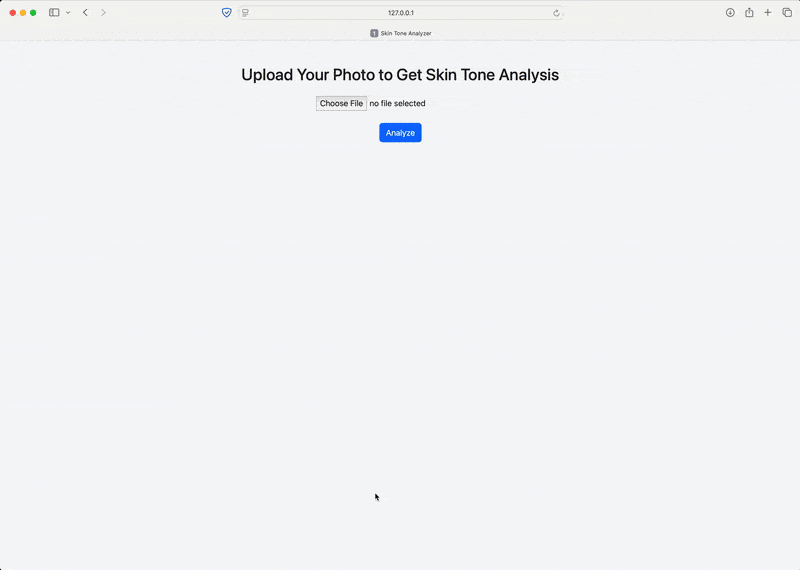
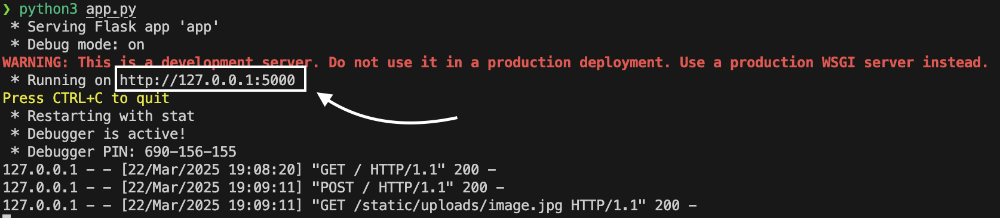
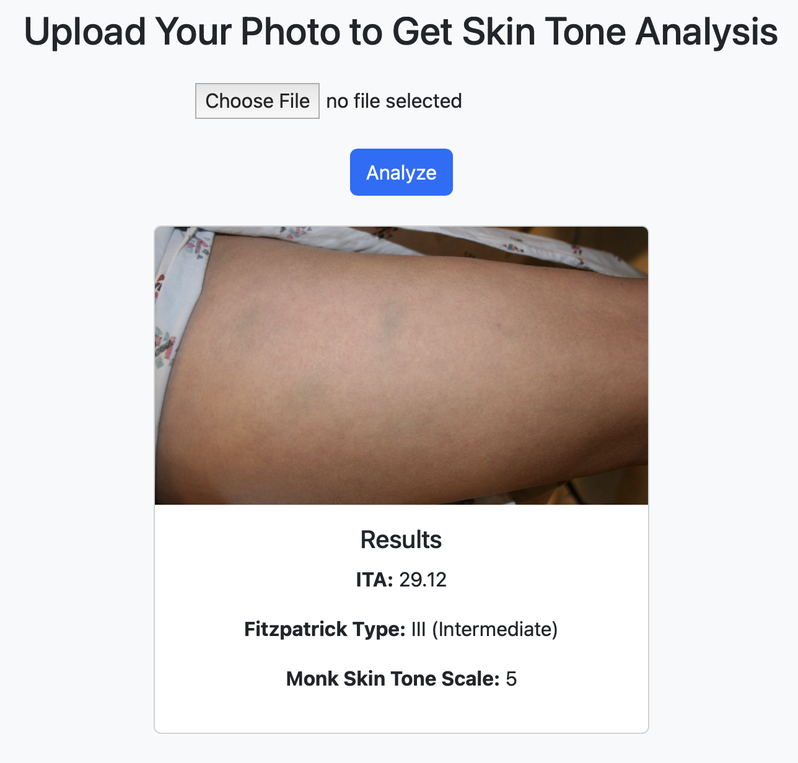

# Transform between ITA, Fitzpatrick and Monk Skin Tone Scale [TIFM]
This project provides code to convert between three major skin color models: Individual Typology Angle (ITA), Fitzpatrick, and the Monk Skin Tone Scale. By enabling interoperability between these representations, there is a potential to support research in dermatology, computer vision, and fairness in AI.

## Important Links

| [Timesheet](https://1sfu-my.sharepoint.com/:x:/g/personal/hamarneh_sfu_ca/EVzrKxoqTBhBsnZ7Bn1OLCUBmp6XPn5tKw3TadBanr7LiQ?e=WcadSt) | [Slack channel](https://cmpt419spring2025.slack.com/archives/C086RGM0DPB) | [Project report](https://www.overleaf.com/3181635329dsvqshmwvmyz#fe2229) |
|-----------|---------------|-------------------------|

## Skin Tone Classification
In the `code/models/` directory, there exist python program `ita.py` that reads all the images in the `datasets/small-kaggle` directory and classifies them into 6 different skin tones based on the Individual Typology Angle (ITA) scale. The program reads the images, extracts the skin pixels, and calculates the ITA value for each image. The ITA value is then used to classify the skin tone of the person in different scales (fitzpatrick & monk). The program saves the classified images output as a '.csv' file named `ita-fitz-monk.csv` in the `outputs/` directory.

## Extra Feature - Upload Image and recieve Skin Tone [Demo]
<!-- Record a short video (1:40 - 2 minutes maximum) or gif or a simple screen recording or even using PowerPoint with audio or with text, showcasing your work. -->

The following is a demo of our Skin Tone Detection App. The app allows users to upload an image and detect the skin tone of the person in the image. The app provides the skin tone in three different scales: Individual Typology Angle (ITA), Fitzpatrick, and the Monk Skin Tone Scale. (*Further Improvements under progress*)



## Running the App
To run the app, follow the steps below:
1. Clone the repository
    ```bash
    git clone git@github.com:sfu-cmpt419/2025_1_project_19.git
    ```
2. Navigate to the **app** directory
    ```bash
    cd 2025_1_project_19/skin-tone-app
    ```
3. Install the required packages using the following command:
    ```bash
    pip install -r requirements.txt
    ```
4. Run the app using the following command:
    ```bash
    python3 app.py
    ```
5. Open the browser and navigate to the URL provided in the terminal:


6. Upload an image and view the skin tone in three different scales.


<!-- 
## Table of Contents
1. [Demo](#demo)

2. [Installation](#installation)

3. [Reproducing this project](#repro)

4. [Guidance](#guide)


<a name="demo"></a>
## 1. Example demo

A minimal example to showcase your work

```python
from amazing import amazingexample
imgs = amazingexample.demo()
for img in imgs:
    view(img)
```

### What to find where

Explain briefly what files are found where

```bash
repository
├── src                          ## source code of the package itself
├── scripts                      ## scripts, if needed
├── docs                         ## If needed, documentation   
├── README.md                    ## You are here
├── requirements.yml             ## If you use conda
```

<a name="installation"></a>

## 2. Installation

Provide sufficient instructions to reproduce and install your project. 
Provide _exact_ versions, test on CSIL or reference workstations.

```bash
git clone $THISREPO
cd $THISREPO
conda env create -f requirements.yml
conda activate amazing
```

<a name="repro"></a>
## 3. Reproduction
Demonstrate how your work can be reproduced, e.g. the results in your report.
```bash
mkdir tmp && cd tmp
wget https://yourstorageisourbusiness.com/dataset.zip
unzip dataset.zip
conda activate amazing
python evaluate.py --epochs=10 --data=/in/put/dir
```
Data can be found at ...
Output will be saved in ...

<a name="guide"></a>
## 4. Guidance

- Use [git](https://git-scm.com/book/en/v2)
    - Do NOT use history re-editing (rebase)
    - Commit messages should be informative:
        - No: 'this should fix it', 'bump' commit messages
        - Yes: 'Resolve invalid API call in updating X'
    - Do NOT include IDE folders (.idea), or hidden files. Update your .gitignore where needed.
    - Do NOT use the repository to upload data
- Use [VSCode](https://code.visualstudio.com/) or a similarly powerful IDE
- Use [Copilot for free](https://dev.to/twizelissa/how-to-enable-github-copilot-for-free-as-student-4kal)
- Sign up for [GitHub Education](https://education.github.com/) 

-->